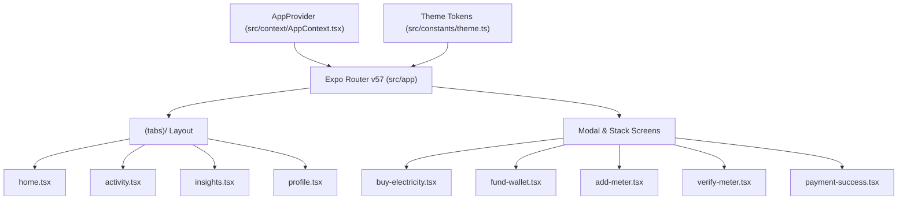

# Smart Electricity App - Comprehensive Project Documentation

> **Version:** 1.0.0  
> **Target Framework:** Expo SDK 57 (React Native 0.86.2, React 19.2.3, Expo Router v57)  
> **Last Updated:** August 25, 2026  

---

## 1. Overview & Key Capabilities

The **Smart Electricity App** is a production-grade React Native mobile application built on Expo SDK 57. It provides a complete end-to-end digital experience for prepaid electricity utility customers across Nigeria to manage their electricity meters, purchase tokens instantly, fund digital wallets, and optimize energy usage.

### 🌟 Core Capabilities

1. **Token Purchase Engine**:
   - Live conversion from Fiat currency (₦) to kilowatt-hours ($\approx \text{₦}235.30/\text{kWh}$).
   - Automated 20-digit prepaid token generation (`XXXX XXXX XXXX XXXX XXXX`).
   - 1-tap copy to clipboard and step-by-step physical meter loading instructions.

2. **Multi-Method Wallet Funding (`src/app/fund-wallet.tsx`)**:
   - 4-step funding flow supporting Debit/Credit Cards (Visa, Mastercard, Verve), Virtual Bank Transfers (dedicated Wema/SmartPay accounts), and USSD codes.
   - Live wallet balance updates across all app screens.

3. **Multi-Meter Management (`src/app/add-meter.tsx`, `src/app/verify-meter.tsx`)**:
   - Manage multiple meters (Home, Office, Business) across all major Nigerian DISCOs (YEDC, AEDC, EKEDC, IBEDC, KEDC, PHED, EEDC, JEDC, BEDC, KAEDCO).
   - Simulated DISCO API lookup for meter verification and owner details.

4. **Energy Analytics & Bento Insights (`src/app/(tabs)/insights.tsx`)**:
   - Bento grid layout showing estimated days remaining, monthly spend, units used, and daily average.
   - Interactive period filter (Week, Month, Year) for usage trend analysis.
   - AI Energy Assistant providing actionable advice to lower consumption.

5. **Activity Ledger (`src/app/(tabs)/activity.tsx`)**:
   - Comprehensive ledger with filter tabs (All, Token Purchases, Wallet Funding) and real-time status indicators.

---

## 2. Technical Architecture



### File Hierarchy & Screen Routes

| Route | File Path | Purpose |
| :--- | :--- | :--- |
| `/` | `src/app/index.tsx` | Route guard checking auth & onboarding flags |
| `/onboarding` | `src/app/onboarding.tsx` | 3-step animated onboarding carousel |
| `/signup` | `src/app/signup.tsx` | User registration & login screen |
| `/(tabs)/home` | `src/app/(tabs)/home.tsx` | Executive Energy Dashboard with circular progress ring |
| `/(tabs)/activity` | `src/app/(tabs)/activity.tsx` | Transaction activity ledger |
| `/(tabs)/insights` | `src/app/(tabs)/insights.tsx` | Energy analytics Bento grid & AI Assistant |
| `/(tabs)/profile` | `src/app/(tabs)/profile.tsx` | Account details & meter management |
| `/buy-electricity` | `src/app/buy-electricity.tsx` | Token purchase & review modal |
| `/fund-wallet` | `src/app/fund-wallet.tsx` | Multi-step wallet top-up flow |
| `/add-meter` | `src/app/add-meter.tsx` | Meter linking form |
| `/verify-meter` | `src/app/verify-meter.tsx` | DISCO API meter verification |
| `/payment-success` | `src/app/payment-success.tsx` | 20-digit token receipt & meter loading guide |

---

## 3. Design System

The app utilizes a tailored design system defined in [`src/constants/theme.ts`](file:///c:/Users/Musa%20A.%20Abubakar/Desktop/smart-electricity-app/src/constants/theme.ts):

- **Colors**: Deep Navy (`#0f172a`), Electric Green Accent (`#84cc16`), Darker Green Status (`#416900`), Light Canvas (`#fcf8fa`), Tonal Layer Surfaces (`#f8fafc`).
- **Typography**: Google Inter font family (`Inter_400Regular`, `Inter_500Medium`, `Inter_600SemiBold`, `Inter_700Bold`).
- **Border Radii**: `Rounded.lg` (16px), `Rounded.xl` (24px), `Rounded.full` (9999px).

---

## 4. Developer Setup & Scripts

```bash
# Install dependencies
npm install

# Start Expo dev server
npm run start

# Launch on specific targets
npm run android
npm run ios
npm run web
```
