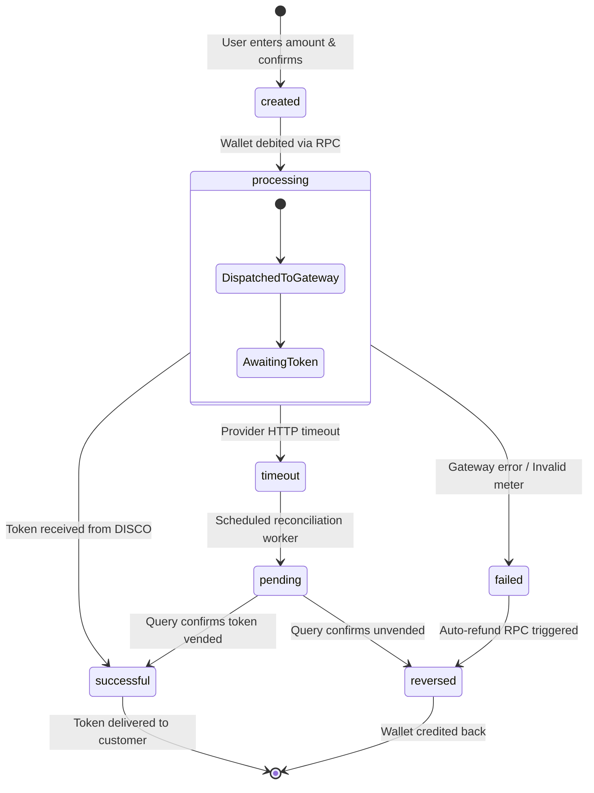

# Smart Electricity — Production Backend & Data Foundation Architecture (Phase 1)

> **Document Version:** 1.0.0  
> **Status:** Production Architecture Specification & Reference  
> **Date:** August 25, 2026  
> **Target Framework:** Expo SDK 57 | React Native 0.86.2 | Supabase / PostgreSQL 15+ | TypeScript 6.0.3  

---

## 1. Executive Summary & Core Philosophy

The primary objective of **Phase 1** is to transition **Smart Electricity** from a client-side prototype into a **server-authoritative utility application**. 

### 🛡️ The Server-Authoritative Principle
The mobile client (React Native / Expo) is strictly a presentation and interaction layer. The mobile app is **NEVER** the source of truth for:
- User wallet balances
- Electricity transaction statuses
- Payment success or verification
- Electricity STS token delivery
- Meter verification or DISCO customer ownership
- Immutable financial accounting records

Every financial operation, state mutation, token generation, and meter verification is authoritative on the backend.

---

## 2. Supabase PostgreSQL Schema

The production schema is managed through declarative SQL migrations in `supabase/migrations/20260825000001_initial_schema.sql`.

```
┌──────────────────────────────────────────────────────────────────────────────────────────┐
│                                 POSTGRESQL ENTITY RELATIONSHIP                           │
├──────────────────────────────────────────────────────────────────────────────────────────┤
│                                                                                          │
│   ┌────────────────────┐          1:1          ┌───────────────────────────┐             │
│   │    auth.users      ├──────────────────────►│      public.profiles      │             │
│   │ (Supabase Auth)    │                       │  • full_name, email       │             │
│   └────────────────────┘                       │  • phone_number, avatar   │             │
│                                                └─────────────┬─────────────┘             │
│                                                              │                           │
│                     ┌────────────────────────────────────────┼─────────────────────┐     │
│                     │ 1:1                                    │ 1:N                 │ 1:N │
│                     ▼                                        ▼                     ▼     │
│         ┌───────────────────────┐               ┌───────────────────────┐  ┌───────────┐ │
│         │public.wallet_accounts │               │     public.meters     │  │notifica...│ │
│         │ • balance_kobo >= 0   │               │  • meter_number       │  └───────────┘ │
│         │ • currency = 'NGN'    │               │  • disco_code, is_act │                │
│         └───────────┬───────────┘               └───────────┬───────────┘                │
│                     │                                       │                            │
│         ┌───────────┴───────────┐                           │ 1:N                        │
│         │ 1:N                   │ 1:N                       │                            │
│         ▼                       ▼                           ▼                            │
│  ┌──────────────┐       ┌──────────────┐         ┌─────────────────────────┐             │
│  │payment_att...│       │wallet_trans..│◄────────┤electricity_transactions │             │
│  │(Funding Logs)│       │(Double-Entry)│         │ • amount_kobo, units_kwh│             │
│  └──────────────┘       └──────────────┘         │ • token, status, ref    │             │
│                                                  └─────────────────────────┘             │
└──────────────────────────────────────────────────────────────────────────────────────────┘
```

### Complete Table Catalog

| Table Name | Primary Key | Description & Integrity Rules |
| :--- | :--- | :--- |
| `public.profiles` | UUID (PK, FK `auth.users.id`) | Stores user account metadata, full name, phone number, and onboarding status. |
| `public.wallet_accounts` | UUID (PK) | Authoritative ledger balance in **Kobo** (`BIGINT`). Enforces `balance_kobo >= 0` check constraint. |
| `public.meters` | UUID (PK) | Registered electricity meters. Enforces `UNIQUE(user_id, meter_number, disco_code)`. |
| `public.meter_verifications` | UUID (PK) | Log of all meter queries made against utility providers with raw JSON response payloads. |
| `public.payment_attempts` | UUID (PK) | Tracks all inbound wallet funding attempts (Paystack / Flutterwave) with idempotency keys. |
| `public.wallet_transactions` | UUID (PK) | Immutable double-entry ledger tracking every credit, debit, and reversal with `balance_before` and `balance_after`. |
| `public.electricity_transactions` | UUID (PK) | Full lifecycle log for token purchases: reference, units (kWh), STS token, status enum. |
| `public.consumption_records` | UUID (PK) | Daily telemetry and kilowatt-hour consumption metrics for analytics and prediction. |
| `public.notifications` | UUID (PK) | User notifications with read/unread flags and contextual metadata. |
| `public.audit_logs` | UUID (PK) | Tamper-evident audit trail capturing security and administrative actions. |

---

## 3. Financial Integrity & Idempotency

### Anti-Tampering & Ledger Rules
1. **Integer Arithmetic in Kobo:** All monetary values (`amount_kobo`, `balance_kobo`, `balance_before_kobo`, `balance_after_kobo`) are stored as 64-bit integers (`BIGINT`) representing **Kobo** ($100\text{ Kobo} = \text{₦}1.00$). This eliminates floating-point rounding errors.
2. **Database Check Constraints:** `public.wallet_accounts` enforces `CHECK (balance_kobo >= 0)`. Any attempt to debit more than the current balance throws an immediate database exception.
3. **Pessimistic Row Locking (`SELECT ... FOR UPDATE`):** When executing debits, credits, or vending transactions, the database locks the specific user wallet row to prevent concurrent race conditions.
4. **Idempotency Keys:** Every mutation includes a unique `idempotency_key` (e.g. `FUND-{userId}-{reference}`). If a network retry occurs, the RPC returns the existing processed transaction rather than duplicating the financial operation.

### Stored Procedure RPCs

- **`credit_wallet_from_payment(p_user_id, p_payment_attempt_id, p_idempotency_key)`**
  Locks the wallet, validates the payment attempt status, increments the balance, writes the immutable ledger entry, and creates a funding notification in a single atomic transaction.
- **`debit_wallet_for_electricity(p_user_id, p_amount_kobo, p_electricity_tx_id, p_idempotency_key)`**
  Locks the wallet, verifies `balance_kobo >= p_amount_kobo`, performs the deduction, and records the purchase debit.
- **`refund_electricity_purchase(p_user_id, p_electricity_tx_id, p_reason)`**
  Handles vending failures or timeouts by safely crediting the exact amount back to the user's wallet and marking the transaction as `reversed`.

---

## 4. Row Level Security (RLS) Policy Matrix

All 10 tables have Row Level Security permanently enabled. Zero client operations can read or write across tenant boundaries.

```sql
-- Example RLS Enforcement
ALTER TABLE public.wallet_accounts ENABLE ROW LEVEL SECURITY;

CREATE POLICY "Users can view own wallet"
    ON public.wallet_accounts FOR SELECT
    USING (auth.uid() = user_id);
```

| Table | SELECT | INSERT | UPDATE | DELETE |
| :--- | :--- | :--- | :--- | :--- |
| `profiles` | `auth.uid() = id` | System (Trigger) | `auth.uid() = id` | Disabled |
| `wallet_accounts` | `auth.uid() = user_id` | System (Trigger) | System (RPC Only) | Disabled |
| `meters` | `auth.uid() = user_id` | `auth.uid() = user_id` | `auth.uid() = user_id` | `auth.uid() = user_id` |
| `meter_verifications` | `auth.uid() = user_id` | `auth.uid() = user_id` | Disabled | Disabled |
| `payment_attempts` | `auth.uid() = user_id` | `auth.uid() = user_id` | System (Webhook) | Disabled |
| `wallet_transactions`| `auth.uid() = user_id` | System (RPC Only) | Disabled (Immutable) | Disabled |
| `electricity_transactions` | `auth.uid() = user_id` | `auth.uid() = user_id` | System (Edge Function) | Disabled |
| `consumption_records`| `auth.uid() = user_id` | System (Telemetry) | Disabled | Disabled |
| `notifications` | `auth.uid() = user_id` | System | `auth.uid() = user_id` | Disabled |
| `audit_logs` | `auth.uid() = user_id` | System | Disabled | Disabled |

---

## 5. API Boundary & Provider Abstraction

All external utility vendor integrations conform to the `ElectricityProvider` interface defined in `src/services/providers/ElectricityProvider.ts`.

```
                       ┌───────────────────────────────┐
                       │      ElectricityService       │
                       │     (Application Domain)      │
                       └───────────────┬───────────────┘
                                       │
                                       ▼
                       ┌───────────────────────────────┐
                       │   ElectricityProviderFactory  │
                       └───────────────┬───────────────┘
                                       │ Resolves Provider
                                       ▼
                       ┌───────────────────────────────┐
                       │     «ElectricityProvider»     │
                       │          (Interface)          │
                       │  • verifyMeter()              │
                       │  • vendToken()                │
                       │  • queryTransactionStatus()   │
                       │  • getDiscos()                │
                       └───────────────┬───────────────┘
                                       │
            ┌──────────────────────────┴──────────────────────────┐
            ▼                                                     ▼
┌───────────────────────┐                             ┌───────────────────────┐
│    VTpassProvider     │                             │  DirectDISCOProvider  │
│ (Active Gateway Imp)  │                             │   (Future Gateway)    │
└───────────────────────┘                             └───────────────────────┘
```

### Provider Contract
- **`verifyMeter(req)`**: Validates meter format and retrieves customer name, address, and tariff code.
- **`vendToken(req)`**: Dispatches vending request with mandatory idempotency key.
- **`queryTransactionStatus(req)`**: Polls or verifies unconfirmed transactions.
- **`getDiscos()`**: Returns active distribution company directory across Nigeria (AEDC, EKEDC, IKEDC, IBEDC, EEDC, PHED, KEDCO, KAEDCO, JEDC, BEDC, YEDC).

---

## 6. Complete Transaction Lifecycle State Machine



| Lifecycle State | Description | Financial State |
| :--- | :--- | :--- |
| `created` | Purchase initiated by customer; parameters validated. | No balance change. |
| `processing` | Atomic RPC has locked and debited user wallet. Request sent to utility provider. | Wallet debited (`purchase_debit`). |
| `successful` | Utility provider generated 20-digit STS token. Token stored in database. | Wallet debited; token issued. |
| `failed` | Utility rejected request (e.g. meter debt, network outage). | Automatic refund triggered (`refund_credit`). |
| `timeout` | Gateway did not reply within 30s. **Never assumed failed**. | Held in `pending` reconciliation queue. |
| `pending` | Background worker actively querying gateway transaction query endpoint. | Debit maintained until resolution. |
| `reversed` | Transaction confirmed canceled/unvended; balance restored to customer. | Fully refunded to wallet. |

---

## 7. Service Architecture Layer

All backend interactions are organized into decoupled, strongly typed domain services in `src/services/`:

- **`AuthService`** (`src/services/auth.service.ts`): User authentication, profile resolution, and session management.
- **`WalletService`** (`src/services/wallet.service.ts`): Server-authoritative balance queries, funding flows, and ledger history.
- **`MetersService`** (`src/services/meters.service.ts`): Meter verification through provider abstraction and meter management.
- **`ElectricityService`** (`src/services/electricity.service.ts`): Token vending lifecycle state machine, tariff calculation, and receipt generation.
- **`AnalyticsService`** (`src/services/analytics.service.ts`): Energy projections, average usage analysis, and trend datasets.
- **`NotificationsService`** (`src/services/notifications.service.ts`): User alert queries and mark-read mutations.

---

## 8. Environment Variables Strategy

Environment variables are partitioned to enforce zero leakage of server secrets:

```
┌─────────────────────────────────────────────────────────────────────────────┐
│                           ENVIRONMENT VARIABLE MATRIX                       │
├──────────────────────────────┬───────────────┬──────────────────────────────┤
│ Variable Name                │ Visibility    │ Purpose                      │
├──────────────────────────────┼───────────────┼──────────────────────────────┤
│ EXPO_PUBLIC_APP_ENV          │ Client        │ development / staging / prod │
│ EXPO_PUBLIC_SUPABASE_URL     │ Client        │ Supabase Project URL         │
│ EXPO_PUBLIC_SUPABASE_ANON_KEY│ Client        │ Public anonymous RLS key     │
│ EXPO_PUBLIC_PAYSTACK_PUBLIC_K│ Client        │ Public client checkout key   │
│ SUPABASE_SERVICE_ROLE_KEY    │ 🔒 SERVER-ONLY │ Administrative backend bypass│
│ PAYSTACK_SECRET_KEY          │ 🔒 SERVER-ONLY │ Webhook & charge verification│
│ PAYSTACK_WEBHOOK_SECRET      │ 🔒 SERVER-ONLY │ HMAC signature verification  │
│ VTPASS_API_KEY               │ 🔒 SERVER-ONLY │ Utility vending gateway auth │
│ VTPASS_SECRET_KEY            │ 🔒 SERVER-ONLY │ Utility vending gateway auth │
│ GEMINI_API_KEY               │ 🔒 SERVER-ONLY │ AI Energy Advisor LLM key    │
└──────────────────────────────┴───────────────┴──────────────────────────────┘
```

---

## 9. Verification & Acceptance Criteria

| Criteria | Status | Details |
| :--- | :--- | :--- |
| **Database Schema** | ✅ Complete | 10 production tables, ENUMs, triggers, and foreign keys created in `supabase/migrations/`. |
| **Financial Integrity** | ✅ Complete | Zero negative balance constraints, `SELECT FOR UPDATE` locking, and idempotent RPCs designed. |
| **Row Level Security** | ✅ Complete | RLS policies implemented for all tables ensuring strict tenant isolation. |
| **Provider Abstraction** | ✅ Complete | `ElectricityProvider` interface and `VTpassProvider` gateway implementation configured. |
| **Secret Isolation** | ✅ Complete | Clean `.env.example` and `src/config/env.ts` separating client and server configs. |
| **UI Stability** | ✅ Complete | Existing 14 screens continue rendering and interacting smoothly. |
| **TypeScript Validation** | ✅ Complete | `npx tsc --noEmit` compiles cleanly with **0 errors**. |
