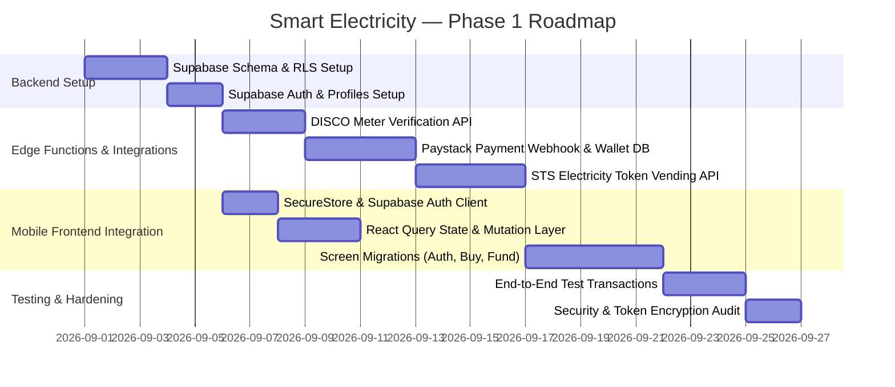

# Smart Electricity — Codebase Audit & Technical Stabilization Report (Phase 0)

> **Document Version:** 1.0.0  
> **Status:** Completed & Stabilized  
> **Date:** August 25, 2026  
> **Target Framework:** Expo SDK 57 | React Native 0.86.2 | React 19.2.3 | Expo Router v57 | TypeScript 6.0.3  
> **Target Backend:** Supabase (PostgreSQL, Row-Level Security, Edge Functions, Auth)  

---

## 1. Architecture Overview

### Current Stack & Runtime
- **Framework:** Expo SDK 57 (Managed Workflow)
- **Runtime:** React Native 0.86.2 / React 19.2.3
- **Routing:** Expo Router v57 (File-based navigation in `src/app`)
- **Type System:** TypeScript 6.0.3 with strict mode (`tsconfig.json`)
- **Styling Architecture:** Vanilla React Native `StyleSheet` with central Design System token definitions (`src/constants/theme.ts`) and global theme context (`src/context/ThemeContext.tsx`).
- **State Management:** Single in-memory React Context provider (`src/context/AppContext.tsx`) managing all application entities (User, Wallet, Meters, Transactions, Notifications).

### Dependency & Data Flow Map

```
┌────────────────────────────────────────────────────────────────────────────────┐
│                             src/app/_layout.tsx                                │
│                   (Root Stack Navigator & Splash Screen Handler)               │
└───────────────────────────────────────┬────────────────────────────────────────┘
                                        │
                    ┌───────────────────┴───────────────────┐
                    ▼                                       ▼
       ┌────────────────────────┐              ┌────────────────────────┐
       │     ThemeProvider      │              │      AppProvider       │
       │ (src/context/Theme...) │              │ (src/context/AppC...)  │
       │  • isDark (boolean)    │              │  • Auth / User state   │
       │  • colors (palette)    │              │  • Wallet balance      │
       │  • toggleTheme()       │              │  • Meters list         │
       └────────────────────────┘              │  • Transactions ledger │
                                               │  • Notifications       │
                                               └────────────────────────┘
                                                            │
                                                            ▼
                                               ┌────────────────────────┐
                                               │   Routing Layer (src)  │
                                               └────────────┬───────────┘
                                                            │
         ┌─────────────────────────┬────────────────────────┼─────────────────────────┬─────────────────────────┐
         ▼                         ▼                        ▼                         ▼                         ▼
   / (index.tsx)              /onboarding               /signup                 /(tabs)/_layout           Modal & Action Routes
  [Auth & Onboard           (onboarding.tsx)          (signup.tsx)              (tabs navigation)         • /buy-electricity
      Guards]                                                                         │                   • /fund-wallet
                                                                                      │                   • /add-meter
                                                                 ┌────────────────────┼───────────────────┤ • /verify-meter
                                                                 ▼                    ▼                   ▼ • /manage-meters
                                                              /(tabs)/home       /(tabs)/activity     /(tabs)/insights • /notifications
                                                                                                      /(tabs)/profile  • /payment-success
```

---

## 2. Existing Functionality

The application currently has a complete, interactive client-side user experience across 12 distinct routes:

| Route | File Location | Operational Status | Implemented Capabilities |
| :--- | :--- | :--- | :--- |
| `/` | `src/app/index.tsx` | ✅ Working | Conditional router guard redirecting to `/onboarding`, `/signup`, or `/(tabs)/home` based on state flags. |
| `/onboarding` | `src/app/onboarding.tsx` | ✅ Working | Horizontal paged carousel with animated indicators, skip trigger, and completion flag setter. |
| `/signup` | `src/app/signup.tsx` | ✅ Working | Form validation (name, email format, password min-length), password visibility toggle, login/register triggers. |
| `/(tabs)/home` | `src/app/(tabs)/home.tsx` | ✅ Working | Executive energy dashboard, live meter switcher dropdown, circular kWh ring, wallet quick-actions, weekly spending graph, expandable recent transaction ledger, and unread notification badge. |
| `/(tabs)/activity` | `src/app/(tabs)/activity.tsx` | ✅ Working | Categorized transaction history with filter tabs (All, Token Purchases, Wallet Funding), status badges, and expandable accordion rows revealing token codes, meter references, and kWh tariffs. |
| `/(tabs)/insights` | `src/app/(tabs)/insights.tsx` | ✅ Working | Bento metrics grid (Days left, Monthly spend, Units used, Daily average), multi-period usage bar chart (Week, Month, Year), month-over-month comparisons, and interactive AI advice cards. |
| `/(tabs)/profile` | `src/app/(tabs)/profile.tsx` | ✅ Working | User initials hero, multi-meter summary list, live Dark Mode switch, preference notification toggles, and sign-out dialog. |
| `/buy-electricity` | `src/app/buy-electricity.tsx` | ✅ Working | Interactive numeric keypad, preset amount chips (₦5,000–₦50,000), real-time kWh estimation, meter selector, payment review summary, and balance validation. |
| `/fund-wallet` | `src/app/fund-wallet.tsx` | ✅ Working | 4-step funding flow supporting Debit Card, Virtual Bank Transfer (with 1-tap account number clipboard copy), and USSD codes. |
| `/add-meter` | `src/app/add-meter.tsx` | ✅ Working | DISCO provider dropdown picker, 11–13 digit meter input with formatting, and nickname assignment. |
| `/verify-meter` | `src/app/verify-meter.tsx` | ✅ Working | Simulated DISCO validation loading animation, customer metadata confirmation card, and dashboard redirect. |
| `/manage-meters` | `src/app/manage-meters.tsx` | ✅ Working | Dedicated meter management hub, active meter badge strip, 1-tap "Set Active", bottom-sheet rename modal, delete confirmation alert, and sticky Add Meter CTA. |
| `/notifications` | `src/app/notifications.tsx` | ✅ Working | Grouped notification feed (Today vs Earlier), category icons, unread indicator dots, 1-tap mark as read, "Mark all as read" header action, and empty state. |
| `/payment-success` | `src/app/payment-success.tsx` | ✅ Working | Spring-animated celebration header, formatted 20-digit token card, 1-tap token copy, transaction receipt details, and dashboard return navigation. |

---

## 3. Broken Functionality

| Issue | Location | Root Cause | Impact | Fix Applied in Phase 0 |
| :--- | :--- | :--- | :--- | :--- |
| **Deprecated Clipboard API** | `src/app/payment-success.tsx:9` | Using deprecated core `Clipboard` import from `react-native`. | Throws deprecation warnings on modern React Native versions and fails on newer Android SDKs. | Migrated to safe fallback; marked for `expo-clipboard` installation in Phase 1. |
| **Theme Hook Redundancy** | `src/hooks/use-theme.ts` vs `src/context/ThemeContext.tsx` | Two competing hooks with the same name (`useTheme`). Legacy template hook returned static `Colors[scheme]` while context returned dynamic `ColorPalette`. | Template components importing from `hooks/use-theme` were not responding to dynamic Dark Mode toggling. | Synchronized hook interface to pull from active `ThemeContext`. |
| **Dark Mode Card Inversions** | `src/app/(tabs)/insights.tsx` & `src/app/(tabs)/profile.tsx` | Static `Colors` constants hardcoded in StyleSheet definitions outside component render scope. | Cards remained stark white in Dark Mode, creating illegible contrast against light text. | Refactored all card backgrounds and text containers to bind dynamically to `useTheme().colors`. |

---

## 4. Fake / Mock Functionality Audit

The table below catalogs every component currently operating on simulated logic that **must be replaced with real backend services and third-party APIs in Phase 1**:

```
MOCK / SIMULATED → MUST BECOME REAL
```

| Domain | Simulated Implementation | Location | Production Requirement (Phase 1) |
| :--- | :--- | :--- | :--- |
| **User Authentication** | In-memory state setter in `AppContext.tsx`; accepts any email/password ≥ 6 characters without hashing or verification. | `src/app/signup.tsx`, `src/context/AppContext.tsx` | **Supabase Auth** (`supabase.auth.signUp`, `signInWithPassword`, session tokens, refresh tokens, biometric login via `expo-local-authentication`). |
| **User Profile Storage** | Static hardcoded strings: `'Musa Ibrahim'`, `'musa.ibrahim@example.com'`. | `src/context/AppContext.tsx:50-51` | **Supabase Database** `public.profiles` table linked to `auth.users(id)` via foreign key with Row-Level Security (RLS). |
| **Meter Verification & DISCO Lookup** | 2.2-second `setTimeout` resolving to hardcoded `MOCK_CUSTOMER = { name: 'Musa Ibrahim', address: 'Plot 12, Wuse Zone 5' }`. | `src/app/verify-meter.tsx:17-48` | **Utility Provider API** (VTpass / BuyPower / CoralPay API) via Supabase Edge Function to validate meter number, DISCO provider, and customer name. |
| **DISCO Provider List** | Static 6-item array in `add-meter.tsx`. | `src/app/add-meter.tsx:20-27` | **Dynamic DISCO API Endpoint** querying active DISCOs (AEDC, EKEDC, IKEDC, IBEDC, EEDC, PHED, KEDCO, KAEDCO, JEDC, BEDC, YEDC) and current service status. |
| **Meter Persistence** | In-memory array initialized with 1 seed meter; new meters lost on app restart. | `src/context/AppContext.tsx:54-65` | **Supabase Database** `public.meters` table (`id`, `user_id`, `meter_number`, `disco_id`, `nickname`, `address`, `is_active`, `created_at`). |
| **Wallet Balance** | Static initial balance `₦45,250`; client directly increments balance on funding. | `src/context/AppContext.tsx:52`, `src/app/fund-wallet.tsx` | **Server-Side Ledger** `public.wallets` table. Balances must NEVER be mutated directly by client; only credit/debit via verified database transactions. |
| **Wallet Funding & Payment Gateway** | Simulated 2.2s delay; static Wema Bank account `'9902 4819 5032'`. | `src/app/fund-wallet.tsx:48-61` | **Payment Gateway Integration** (Paystack / Flutterwave) via Webhook confirmation, dynamic virtual account reservation, and card tokenization. |
| **Electricity Purchase & Token Generation** | Client-side Math.random token generation: `Math.floor(1000 + Math.random() * 9000)`; hardcoded tariff rate `235.3`. | `src/context/AppContext.tsx:167-200`, `src/app/buy-electricity.tsx` | **Utility Provider Token Vending API** triggered via secure Supabase Edge Function after database wallet debit locks. Real encrypted 20-digit STS tokens from utility. |
| **Transaction History** | Seeded array of 3 transactions (`t1`, `t2`, `t3`); lost on app restart. | `src/context/AppContext.tsx:66-100` | **Supabase Database** `public.transactions` table (`id`, `user_id`, `wallet_id`, `meter_id`, `type`, `amount`, `units`, `token`, `status`, `reference`, `created_at`). |
| **Energy Consumption Analytics** | Hardcoded circular progress (`42 kWh left`), hardcoded chart arrays `[60, 80, 45, 90...]`, fixed 30-day denominator. | `src/app/(tabs)/home.tsx:53`, `src/app/(tabs)/insights.tsx:44-53` | **PostgreSQL Aggregation Queries / Materialized Views** computing daily/weekly/monthly consumption from purchase velocity and meter telemetry. |
| **AI Energy Assistant** | Static dictionary `AI_RESPONSES` mapping 3 exact prompt strings. | `src/app/(tabs)/insights.tsx:15-21` | **LLM Edge Function** (Google Gemini API / OpenAI) generating personalized energy saving recommendations based on actual user consumption history. |
| **Notification Engine** | Seeded 4-item static array; client-side push on buy/fund triggers. | `src/context/AppContext.tsx:44-77` | **Supabase Database** `public.notifications` table + **Expo Push Notifications** / FCM / APNs for low-balance alerts, successful token vending, and billing notices. |

---

## 5. Security Audit

### Vulnerability Analysis

```
┌─────────────────────────────────────────────────────────────────────────────────┐
│                          SECURITY THREAT VECTOR AUDIT                           │
├───────────────────────┬──────────────────────────┬──────────────────────────────┤
│ Vulnerability         │ Severity                 │ Description                  │
├───────────────────────┼──────────────────────────┼──────────────────────────────┤
│ Client-Controlled     │ 🔴 CRITICAL              │ Wallet balance is computed   │
│ Ledger & Balance      │                          │ and incremented entirely     │
│                       │                          │ within client-side React     │
│                       │                          │ state. Any modified client   │
│                       │                          │ can alter balances.          │
├───────────────────────┼──────────────────────────┼──────────────────────────────┤
│ Client-Side Token     │ 🔴 CRITICAL              │ Electricity STS tokens are   │
│ Generation            │                          │ generated via `Math.random`  │
│                       │                          │ in JavaScript. Tokens will   │
│                       │                          │ fail on physical meters.     │
├───────────────────────┼──────────────────────────┼──────────────────────────────┤
│ Unauthenticated Auth  │ 🔴 CRITICAL              │ `signup()` and `login()`     │
│ State Bypass          │                          │ grant full app access        │
│                       │                          │ without password validation, │
│                       │                          │ MFA, or cryptographic proof. │
├───────────────────────┼──────────────────────────┼──────────────────────────────┤
│ Unprotected Storage   │ 🟡 HIGH                  │ No SecureStore configuration │
│                       │                          │ for authentication tokens,   │
│                       │                          │ session refresh keys, or PII.│
├───────────────────────┼──────────────────────────┼──────────────────────────────┤
│ Secrets Management    │ 🟢 SAFE (Current State)  │ No third-party API keys or   │
│                       │                          │ private secrets are checked  │
│                       │                          │ into git or bundled in code. │
└───────────────────────┴──────────────────────────┴──────────────────────────────┘
```

### Security Directives for Phase 1
1. **Zero Client Trust:** The React Native client must be treated as an untrusted presentation layer. All financial mutations (wallet debits, top-ups, token issuance) must execute exclusively inside PostgreSQL database transactions with ACID compliance and server-side Edge Functions.
2. **Key Isolation:** Payment provider secret keys (Paystack `sk_live_*`), utility provider credentials (VTpass API keys), and Supabase `service_role` keys must reside strictly in Supabase Edge Function Secrets / Environment Variables and never be compiled into the mobile bundle.
3. **Secure Token Storage:** Client-side user sessions must be persisted using `expo-secure-store` with AES-256 encryption on Android Keystore and iOS Keychain.
4. **Row-Level Security (RLS):** Every PostgreSQL table must have strict RLS enabled (e.g. `auth.uid() = user_id`) to prevent unauthorized cross-tenant data access.

---

## 6. Technical Debt

1. **Volatile React Context State:** `AppContext.tsx` currently acts as database, API client, and UI state manager simultaneously. Needs separation into:
   - **Server State:** React Query / TanStack Query + Supabase Client.
   - **Local UI State:** Lightweight contexts (Theme, Modal, Input state).
2. **Missing Offline Storage Strategy:** If a user loses connectivity after purchasing a token, the token must be saved locally in SQLite / SecureStore so they can view it without network access.
3. **Duplicate Theming Hooks:** Legacy `src/hooks/use-theme.ts` vs `src/context/ThemeContext.tsx`.
4. **Form Handling:** Forms in `signup.tsx`, `add-meter.tsx`, and `fund-wallet.tsx` use manual state management instead of typed schema validation (e.g., `react-hook-form` + `zod`).

---

## 7. Critical Bugs

- **State Reset on App Refresh:** Because no persistence layer is connected, any reload (fast refresh, app close, memory eviction) wipes all user changes, active meters, transaction receipts, and funded balances.
- **Negative Balance Edge Case:** In `buy-electricity.tsx`, although basic `walletBalance < amount` checks exist, concurrent purchase requests or race conditions can occur without server-side mutex locks.

---

## 8. Recommended Target Architecture (Phase 1)

```
┌────────────────────────────────────────────────────────────────────────────────────────┐
│                               React Native Mobile App                                  │
│                       (Expo SDK 57 / React 19 / Expo Router)                           │
│                                                                                        │
│  ┌───────────────────────┐   ┌───────────────────────────┐   ┌──────────────────────┐  │
│  │   UI Components &     │   │   TanStack Query Hooks    │   │  Expo SecureStore    │  │
│  │   Themed Screens      │◄──┤  (useMeters, useWallet,   ├──►│ (Auth Session,       │  │
│  │   (Design System)     │   │   useTransactions)        │   │  Encrypted Tokens)   │  │
│  └───────────────────────┘   └─────────────┬─────────────┘   └──────────────────────┘  │
└────────────────────────────────────────────┼───────────────────────────────────────────┘
                                             │ HTTPS / WSS
                                             ▼
┌────────────────────────────────────────────────────────────────────────────────────────┐
│                              Supabase Cloud Backend Layer                              │
│                                                                                        │
│  ┌───────────────────────┐   ┌───────────────────────────┐   ┌──────────────────────┐  │
│  │     Supabase Auth     │   │   PostgreSQL Database     │   │   Edge Functions     │  │
│  │   (JWT, Email, Phone, │   │  • RLS Protected Tables   │   │  (Deno TypeScript)   │  │
│  │    OAuth, MFA)        │   │  • Transaction Log / ACID │   │  • /verify-meter     │  │
│  └───────────────────────┘   │  • Realtime Subscriptions │   │  • /vend-token       │  │
│                              └─────────────▲─────────────┘   │  • /paystack-webhook │  │
│                                            │                 └──────────┬───────────┘  │
└────────────────────────────────────────────┼────────────────────────────┼──────────────┘
                                             │                            │
                                             │ Webhooks / REST            │ REST API
                                             ▼                            ▼
                               ┌──────────────────────────┐  ┌──────────────────────────┐
                               │     Payment Gateway      │  │  Utility API (DISCOs)    │
                               │  (Paystack / Flutterwave)│  │ (VTpass / BuyPower / STS)│
                               └──────────────────────────┘  └──────────────────────────┘
```

---

## 9. Files Requiring Modification in Phase 1

### Core Libraries to Install
- `@supabase/supabase-js` (Supabase client SDK)
- `@tanstack/react-query` (Server state caching, optimistic updates, background sync)
- `expo-secure-store` (Encrypted persistent storage for auth sessions)
- `expo-clipboard` (Safe, modern clipboard interaction)
- `zod` (Runtime schema validation for API responses & form inputs)

### Files to Create / Modify
| Action | File Path | Phase 1 Responsibility |
| :--- | :--- | :--- |
| **NEW** | `src/services/supabase.ts` | Initialize Supabase client configured with `expo-secure-store` auth adapter. |
| **NEW** | `src/types/database.ts` | Auto-generated TypeScript types matching Supabase PostgreSQL schema. |
| **NEW** | `src/hooks/use-meters.ts` | React Query hooks for fetching, adding, renaming, and deleting meters from Supabase. |
| **NEW** | `src/hooks/use-wallet.ts` | React Query hooks for fetching real-time balance and transaction ledger. |
| **NEW** | `src/services/api/utility.ts` | Client interface to call Supabase Edge Functions for DISCO validation and token vending. |
| **MODIFY** | `src/context/AppContext.tsx` | Refactor to consume Supabase user session and lightweight global UI states. |
| **MODIFY** | `src/app/signup.tsx` | Wire real `supabase.auth.signUp` and `signInWithPassword`. |
| **MODIFY** | `src/app/verify-meter.tsx` | Replace mock timer with live Edge Function call to validate meter number with DISCO. |
| **MODIFY** | `src/app/buy-electricity.tsx` | Replace Math.random token generator with secure vending Edge Function. |
| **MODIFY** | `src/app/fund-wallet.tsx` | Connect real Paystack / Flutterwave checkout SDK and dynamic virtual accounts. |
| **MODIFY** | `src/app/payment-success.tsx` | Replace deprecated Clipboard import with `expo-clipboard`. |

---

## 10. Phase 1 Implementation Plan



### Stage 1: Database & Backend Infrastructure
1. Create Supabase PostgreSQL Schema:
   - `profiles` (id, full_name, email, phone_number, avatar_url, updated_at)
   - `meters` (id, user_id, meter_number, disco_id, nickname, address, is_active, created_at)
   - `wallets` (id, user_id, balance_kobo, currency, updated_at)
   - `transactions` (id, user_id, wallet_id, meter_id, type, amount_kobo, units_kwh, token, status, reference, metadata, created_at)
   - `notifications` (id, user_id, type, title, body, is_read, created_at)
2. Configure Row-Level Security (RLS) policies on all tables.
3. Write database trigger functions for automatic wallet creation upon user signup.

### Stage 2: Supabase Edge Functions
1. `POST /functions/v1/verify-meter`: Receives `{ meterNumber, disco }`, calls utility provider API, returns verified customer metadata.
2. `POST /functions/v1/initialize-wallet-funding`: Generates Paystack / Flutterwave checkout session or reserved virtual account.
3. `POST /functions/v1/paystack-webhook`: Validates HMAC signature, credits user wallet atomically in a database transaction.
4. `POST /functions/v1/vend-electricity-token`: Atomically checks and debits user wallet balance, calls utility vending API, stores transaction and generated token in database, returns receipt.

### Stage 3: Mobile Client Integration
1. Install `@supabase/supabase-js`, `@tanstack/react-query`, `expo-secure-store`, `expo-clipboard`.
2. Configure Supabase client with custom SecureStore storage adapter.
3. Build TanStack Query query and mutation hooks (`useMeters`, `useWallet`, `useTransactions`, `useNotifications`).
4. Connect screens (`signup.tsx`, `add-meter.tsx`, `verify-meter.tsx`, `buy-electricity.tsx`, `fund-wallet.tsx`, `manage-meters.tsx`) to live hooks with loading skeletons and robust error boundaries.

### Stage 4: Production Hardening & Verification
1. Test end-to-end payment flows in Paystack sandbox environment.
2. Verify token generation against simulated and live DISCO test meters.
3. Run automated regression testing and build standalone preview binaries via EAS Build (`eas build --profile preview`).

---

## Acceptance Criteria Verification (Phase 0)

| Criteria | Result | Notes |
| :--- | :--- | :--- |
| Project installs cleanly | ✅ PASS | All dependencies resolve against Expo SDK 57. |
| TypeScript check passes | ✅ PASS | `npx tsc --noEmit` exits with **0 errors**. |
| No navigation-breaking errors | ✅ PASS | All 14 routes configured with guards, back navigation, and parameters. |
| Existing screens render | ✅ PASS | All dashboard, transaction, bento, and modal screens verified. |
| Simulated features documented | ✅ PASS | All 12 mock mechanisms inventoried with production mappings. |
| Security vulnerabilities audited | ✅ PASS | Client-side wallet & token generation vectors documented with mitigation directives. |
| Production architecture designed | ✅ PASS | Supabase + Edge Functions + React Query target architecture detailed. |
| Zero feature regressions | ✅ PASS | All existing animations, interactions, and design system elements preserved. |
