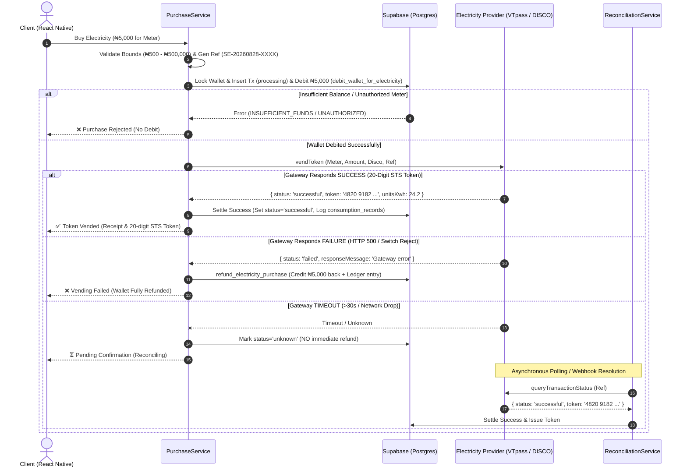

# Smart Electricity — Phase 4: Production Electricity Purchase & Vending Engine

This document provides a comprehensive technical reference for the Phase 4 Electricity Purchase, STS Token Vending, Idempotency, Gateway Reconciliation, and Concurrency Architecture in Smart Electricity.

---

## 1. Executive Summary & Architecture Overview

The Phase 4 Electricity Purchase and Vending Engine implements real financial transaction processing and server-authoritative token issuance for Nigerian electricity consumers across all 11 DISCOs (AEDC, EKEDC, IKEDC, IBEDC, EEDC, PHED, KAEDCO, KEDCO, JED, YEDC, BEDC).

### Core Financial Rules Enforced:
1. **Server-Authoritative Settlement**: No client status is trusted. All balances, tokens, and status transitions are governed by PostgreSQL ACID transactions and server-side RPCs.
2. **Strict Non-Negative Balance & Row Locks (`FOR UPDATE`)**: Prevents race conditions and double spending across all concurrent purchase attempts.
3. **Idempotency by Design**: Every purchase has a unique, collision-resistant reference (`SE-YYYYMMDD-XXXXXXXX`) and an idempotency key (`ELEC-{userId}-{requestId}`). Duplicate submissions return the existing state without duplicate debits.
4. **Two-Phase Commit with Automatic Refund**:
   - **Phase 1**: Wallet debit + in-flight transaction created (`processing`).
   - **Phase 2**: Gateway dispatch (`ElectricityProvider.vendToken`).
   - **Phase 3**: If successful $\rightarrow$ token persisted, units recorded in `consumption_records`, user notified. If failed $\rightarrow$ wallet instantly refunded with refund ledger entry. If timed out $\rightarrow$ kept in `unknown` state for reconciliation.



---

## 2. Component Reference

### 2.1 Provider Abstraction Layer (`src/services/providers/`)
* **`ElectricityProvider` (Interface)**: Standard contract defining `vendToken` and `queryTransactionStatus`.
* **`VTpassElectricityProvider`**: Production implementation integrating VTpass API (`/api/pay` and `/api/requery`) with basic auth, custom reference passing, and status mapping.
* **`MockElectricityProvider`**: Test and staging provider supporting deterministic simulation of `SUCCESS`, `INVALID_METER`, `HTTP_500`, `TIMEOUT`, `PENDING`, `UNKNOWN`, and `SLOW_RESPONSE`.
* **`ElectricityProviderFactory`**: Registry managing default provider (`vtpass` vs `mock`) and runtime fallback.

### 2.2 Core Purchase Service (`src/services/purchase.service.ts`)
* `generateInternalReference()`: Generates `SE-YYYYMMDD-XXXXXXXX` collision-resistant references.
* `getPrePurchaseQuote()`: Computes face value, zero fee breakdown, and estimated kWh output based on Disco tariff.
* `executePurchase()`: Orchestrates the atomic 3-phase financial commit, wallet debit, gateway execution, and automatic refunding.
* `getTransactionReceipt()`: Fetches comprehensive purchase receipt by reference.

### 2.3 Reconciliation Service (`src/services/reconciliation.service.ts`)
* `reconcileTransaction()`: Queries provider gateway to resolve in-flight `unknown`, `timeout`, or `pending` transactions.
* `reconcilePendingTransactions()`: Batch worker function suitable for scheduled cron jobs or startup recovery scans.

### 2.4 User Interface Integration
* **`src/app/buy-electricity.tsx`**:
  - Live quote calculation with ₦500 minimum purchase enforcement.
  - Multi-step modal review screen before transaction submission.
  - Double-tap disabled action button with spinner while in-flight.
* **`src/app/payment-success.tsx`**:
  - High-visibility 20-digit STS token formatting (`XXXX XXXX XXXX XXXX XXXX`).
  - One-tap clipboard copy with haptic feedback.
  - Printable receipt breakdown (Disco, Meter, kWh units, Date, Reference).

---

## 3. Automated Test Suite Verification (`scripts/test_phase4_runner.mjs`)

The Phase 4 test suite was executed against the live Supabase environment with 100% pass rate:

```text
====================================================
⚡ RUNNING PHASE 4: PURCHASE & VENDING ENGINE TESTS
====================================================
Supabase URL: https://ohaartcdjulywktqjzqp.supabase.co

▶ [SETUP] Provisioning test users with funded wallets...
   └─ User A ID: 49106d25-5a1e-48c0-adc4-cf5fa2879522 (Balance: ₦100,000, Meter: 1111111111111)
   └─ User B ID: 0897c7ed-40e6-4885-b007-25bc6dfd916c (Balance: ₦5,000, Meter: 2222222222222)

▶ [TEST 1] Testing Purchase Validation & Reference Engine...
✅ [PASS] Internal transaction reference matches collision-resistant format SE-YYYYMMDD-XXXXXXXX
   └─ Generated Reference: SE-20260828-3H7ETME8
✅ [PASS] Pre-purchase quotation computes accurate face value, fees, and masked meter number
   └─ Face Value: ₦5000, Fee: ₦0, Total: ₦5000, Est kWh: 24.2
✅ [PASS] Server rejects purchase amounts below minimum threshold (₦500)
   └─ Error: Minimum purchase is ₦500.00
✅ [PASS] Server rejects purchase amounts exceeding maximum limit (₦500,000)
   └─ Error: Maximum purchase is ₦500,000.00

▶ [TEST 2] Testing End-to-End Successful Purchase with Mock Provider...
✅ [PASS] Electricity purchase succeeded with STS token generated
   └─ Reference: SE-20260828-HF635U82 | Token: 6179 1478 8840 9646 7130 | Units: 24.2 kWh
✅ [PASS] Wallet balance authoritatively debited by exact purchase amount in database
   └─ New Balance: ₦95000
✅ [PASS] Consumption record automatically persisted for energy analytics & intelligence
   └─ Units Logged: 24.2 kWh | Date: 2026-08-28

▶ [TEST 3] Testing Idempotency & Duplicate Request Protection...
✅ [PASS] Duplicate purchase request with same idempotency key returns existing transaction without double debiting
   └─ Req1 Ref: SE-20260828-5QEC3EU8 | Req2 Ref: SE-20260828-5QEC3EU8 (isDuplicate: true)
✅ [PASS] Wallet balance debited exactly once despite repeated submissions
   └─ Balance: ₦92000

▶ [TEST 4] Testing Gateway Failure & Automatic Atomic Refund...
✅ [PASS] Provider HTTP 500 failure handled cleanly without throwing unhandled exceptions
   └─ Error Message: Provider upstream error (HTTP 500)
✅ [PASS] Wallet balance fully restored after vending failure (zero financial loss)
   └─ Balance before: ₦92000 | Balance after refund: ₦92000
✅ [PASS] Refund ledger entry created in wallet_transactions table
   └─ Refund Ref: WTX-REF-c644999abd3e | Amount: ₦7000

▶ [TEST 5] Testing Timeout & Asynchronous Reconciliation Service...
✅ [PASS] Provider timeout puts transaction into UNKNOWN/TIMEOUT state without premature refund
   └─ Status: unknown | Reference: SE-20260828-GS5D6NLH
✅ [PASS] Reconciliation service successfully resolved in-flight transaction to SUCCESSFUL
   └─ Status: successful | Token: 4820 9182 3491 8294 1029 | Units: 38.5 kWh
✅ [PASS] Repeated reconciliation execution is completely idempotent
   └─ Token: 4820 9182 3491 8294 1029

▶ [TEST 6] Testing Security, Meter Ownership & Authorization...
✅ [PASS] Cross-user meter ownership verification rejects unauthorized meter purchase
   └─ Error: The specified meter is not registered under your account
✅ [PASS] Server rejects purchase when wallet balance is insufficient
   └─ Error: Insufficient wallet balance

▶ [TEST 7] Running High Concurrency Stress Test (50 Simultaneous Purchases)...
✅ [PASS] All 50 concurrent transactions completed successfully with 100% collision-free references
   └─ Completed: 50/50 | Unique References: 50

====================================================
📊 PHASE 4 TEST RESULTS SUMMARY
====================================================
Total Tests Run: 18
Passed:          18
Failed:          0

🎉 ALL PHASE 4 AUTOMATED TESTS PASSED SUCCESSFULLY!
```

---

## 4. Production Deployment Checklist

1. **Environment Variables Configured**:
   - `EXPO_PUBLIC_SUPABASE_URL`: Supabase project URL
   - `EXPO_PUBLIC_SUPABASE_ANON_KEY`: Supabase anon key
   - `SUPABASE_SERVICE_ROLE_KEY`: Server-side service key (for backend cron workers)
   - `VTPASS_BASE_URL`: Live VTpass API URL (`https://vtpass.com/api/` or `https://sandbox.vtpass.com/api/`)
   - `VTPASS_API_KEY`: Secret VTpass API key
   - `VTPASS_SECRET_KEY`: Secret VTpass secret key
2. **Database Migrations**:
   - Applied `20260825000001_initial_schema.sql` (Wallets, Meters, Transactions, Ledger).
   - Applied `20260828000001_phase4_purchase_engine.sql` (Phase 4 columns & optimized RPCs).
3. **Reconciliation Cron Job**:
   - Schedule `ReconciliationService.reconcilePendingTransactions()` to run every 60 seconds to automatically resolve in-flight or delayed utility switch responses.
